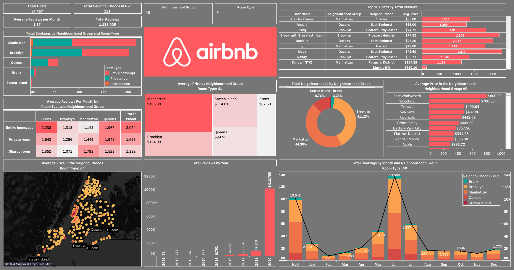

# Airbnb NYC Exploratory Data Analysis

This repository contains an exploratory data analysis of Airbnb listings in New York City for the year 2019. The analysis is presented through an interactive Tableau dashboard.

## Dataset

The dataset used for this analysis is `AB_NYC_2019.csv`, which contains information about Airbnb listings in NYC including:
- Listing details (name, host, location)
- Pricing information
- Availability
- Reviews and ratings
- Room types and neighborhoods

## Dashboard

The interactive dashboard provides visualizations and insights into the Airbnb market in NYC. Key areas covered include pricing trends, neighborhood analysis, room type distribution, and more.

## Files in Repository

- `Airbnb NYC.twbx`: Tableau packaged workbook containing the dashboard
- `Dataset/AB_NYC_2019.csv`: Raw dataset
- `assets/Dashboard.png`: Dashboard screenshot
- `assets/Color Codes.txt`: Airbnb brand colors used in visualizations
- `assets/Airbnb Logo.jpg`: Airbnb logo

## Requirements

To view and interact with the dashboard:
- Tableau Desktop or Tableau Reader
- Open the `Airbnb NYC.twbx` file

## Analysis Overview

This exploratory data analysis aims to uncover patterns and insights from the Airbnb NYC dataset, helping understand the short-term rental market in one of the world's most popular tourist destinations.